# 模型结构演变有向图

> 依据 [`experiment.md`](./experiment.md) 与 [`report.md`](./report.md) 整理。节点中的 `E` 表示实验编号；绿色为保留的正向结构，黄色为近似中性或统计未定，红色为淘汰分支，灰色为工程实现演进，紫色为当前最佳。

```mermaid
flowchart LR
    B0["Baseline 0 · E1<br/>nanoGPT GPT-2 124M<br/>Pre-LN + GELU"]
    R0["E2–E6 · 训练 recipe<br/>LR / WSD / microbatch / Muon"]
    B1["Baseline 1 · E6<br/>microbatch 6 + Muon"]

    QK0["E7 · 无参 QK-Norm<br/>近似无变化"]
    QK1["E8 · QK-Norm<br/>+ 每层每头可学习 logit scale<br/>约 -0.02 val loss"]
    H6["E9 · 12 heads → 6 heads<br/>无明显收益"]
    VE["E10 · 1-bank Value Embedding<br/>共享词表，仅注入最后 4 层<br/>约 -0.01 val loss"]
    B2["Baseline 2 · E10<br/>QK-Norm + learned scale + 1-bank VE"]

    RI["E11 · tiny residual init<br/>residual projection std × 0.1<br/>约 -0.01 val loss"]
    RELU2["E12 · Dense ReLU² FFN<br/>GELU → ReLU(x)²<br/>约 -0.04 val loss"]
    GATE["E13 · Gated Attention<br/>SDPA 输出后 elementwise sigmoid gate<br/>约 -0.01 val loss"]
    B3["Baseline 3 · E13<br/>VE + tiny init + ReLU² + gated attention"]

    DS["E20 · Dense 4h Speedrun<br/>full val 3.036966"]
    RO["E27 · Final readout backout<br/>LN(X12) 与 LN(X8) 按 [1,0] 混合<br/>full val 3.035213"]
    B4["Baseline 4 · E27<br/>Dense Speedrun + readout backout"]

    HP["E33–E45 · 固定时间调参<br/>momentum 0.90 / accum8 / cosine LR"]
    WSD["E46–E48 · WSD linear 30% 候选<br/>LR：.00234/.026 → .003/.03 → .0036/.04<br/>full val：3.008401 → 3.005883 → 3.017362<br/>embedding decay 口径不完全一致"]
    BEST["当前最佳 · E47<br/>LayerNorm + Dense ReLU² + VE + gate + readout<br/>accum8 · AdamW 0.003 · Muon 0.03 · mom 0.90<br/>WSD linear .30 · full val 3.005883"]

    B0 --> R0 --> B1
    B1 --> QK1 --> VE --> B2
    B1 -.-> QK0
    QK1 -.-> H6
    B2 --> RI --> RELU2 --> GATE --> B3
    B3 --> DS --> RO --> B4
    B4 --> HP --> WSD --> BEST

    subgraph ENG["注意力投影工程演进（数学语义保持）"]
        EQKV["Baseline 1<br/>fused QKV [C,3C]"]
        ESPLIT["Baseline 2<br/>独立 Wq / Wk / Wv"]
        EGATE["Baseline 3<br/>fused QKV + 独立 gate"]
        EQKVG["Speedrun<br/>fused QKVG [C,4C]"]
        EQKV --> ESPLIT --> EGATE --> EQKVG
    end

    B1 -.->|实现| EQKV
    B2 -.->|实现| ESPLIT
    B3 -.->|实现| EGATE
    B4 -.->|实现| EQKVG

    subgraph MOE["MoE 分支：样本效率有信号，但 A100 固定时间失败"]
        M0["E14–E17 · 4 experts / top-1<br/>expert dim 3072 → 2048 → 1536<br/>GELU / ReLU²"]
        MS["E19 / E22 · 等参数 SwiGLU MoE<br/>质量略好但更慢"]
        M4H["E21 · MoE 4h Speedrun<br/>full val 3.054115<br/>MFU 约 34%"]
        MWSD["E23 · MoE + WSD<br/>3.044938"]
        MRO["E24 · MoE + readout backout<br/>3.048393"]
        MSC["E25 · embedding shortcut<br/>3.056808"]
        LM["E26 · Efficient LatentMoE<br/>d 768 → latent 384<br/>8 experts / top-1<br/>中途变差，停止/崩溃"]
        MSTOP["停止 MoE 主线<br/>Dense MFU 约 50% vs MoE 约 34%"]

        M0 --> M4H
        M0 --> MS --> M4H
        M4H --> MWSD --> MSTOP
        M4H --> MRO --> MSTOP
        M4H --> MSC --> MSTOP
        MS --> LM --> MSTOP
    end

    B2 --> M0
    B3 --> M0

    subgraph DAB["Baseline 4 的 Dense 结构消融"]
        ED0["E28 · 关闭 embedding decay<br/>3.036915 · 未改善"]
        NOVE["E29 · 完全删除 1-bank VE<br/>3.041136 · 更差"]
        DSW["E30 · 等参数 Dense SwiGLU<br/>3.040597 · 固定时间为负"]
        RMS["E43 · Affine RMSNorm<br/>3.013878 vs 匹配 LN 3.013418<br/>吞吐 +0.14%，统计近似平局偏负"]
        SC2["Identity-init embedding shortcut<br/>每层 x ← a·x + b·x0<br/>固定时间为负"]
    end

    B4 --> ED0 --> NOVE
    B4 --> DSW
    B4 --> RMS
    B3 --> SC2

    classDef base fill:#dbeafe,stroke:#2563eb,color:#172554,stroke-width:2px;
    classDef positive fill:#dcfce7,stroke:#16a34a,color:#14532d,stroke-width:2px;
    classDef neutral fill:#fef3c7,stroke:#d97706,color:#78350f,stroke-width:1.5px;
    classDef negative fill:#fee2e2,stroke:#dc2626,color:#7f1d1d,stroke-width:1.5px;
    classDef engineering fill:#f3f4f6,stroke:#6b7280,color:#111827,stroke-dasharray:5 3;
    classDef best fill:#ede9fe,stroke:#7c3aed,color:#3b0764,stroke-width:3px;

    class B0,B1,B2,B3,B4 base;
    class QK1,VE,RI,RELU2,GATE,RO,HP,WSD positive;
    class QK0,H6,RMS neutral;
    class M0,MS,M4H,MWSD,MRO,MSC,LM,MSTOP,ED0,NOVE,DSW,SC2 negative;
    class EQKV,ESPLIT,EGATE,EQKVG engineering;
    class BEST best;
```

## 阅读方式

1. **最上方主链**是最终保留下来的Dense模型演进：Baseline 0 → Muon → QK-Norm/VE → tiny init/ReLU²/gated attention → Speedrun/readout → momentum/accum/LR调优 → WSD linear 30% → 当前最佳。
2. **MoE分支**从Baseline 2/3分出，包含标准MoE、SwiGLU MoE、WSD、readout、shortcut和Efficient LatentMoE；最终因A100吞吐下降而终止。
3. **Dense消融分支**记录了关闭embedding decay、删除VE、Dense SwiGLU、Affine RMSNorm及embedding shortcut。
4. **灰色工程链**描述Q/K/V/gate投影的实现演进，不应误解为独立的数学结构实验。
